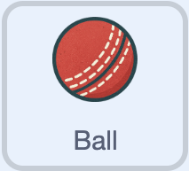

## Bowl a ball

\--- task ---

Open the [starter project](https://scratch.mit.edu/projects/1202431572/editor/){:target="_blank"}.

\--- /task ---

The starter project contains some starter code and all the sprites you need.

\--- task ---

Select the **Ball** sprite.



\--- /task ---

### Take aim

A ball will be bowled to a random stump.

\--- task ---

In the `when I receive New Ball`{:class="block3events"} script, set a random stump to bowl at.

```blocks3
when I receive [New Ball v]
set size to (80)%
go to x: (120) y: (80)
+set [Stump v] to (item(pick random (1) to (3)) of [Stumps v])
```

\--- /task ---

\--- task ---

Tell the player which stump has been selected (so they know where to move their bat later).

```blocks3
when I receive [New Ball v]
set size to (80)%
go to x: (120) y: (80)
set [Stump v] to (item(pick random (1) to (3)) of [Stumps v])
+say (Stump) for (0.5) seconds
```

\--- /task ---

### Bowl at the stump

\--- task ---

Make the ball point towards the selected stump and move towards it until it reaches it.

```blocks3
when I receive [New Ball v]
set size to (80)%
go to x: (120) y: (80)
set [Stump v] to (item(pick random (1) to (3)) of [Stumps v])
say (Stump) for (0.5) seconds
+repeat until <touching (Stump)?>
point towards (Stump)
move (4) steps
end
```

\--- /task ---

### Change the perspective

\--- task ---

Make the ball look smaller as it moves towards the stump.

```blocks3
when I receive [New Ball v]
set size to (80)%
go to x: (120) y: (80)
set [Stump v] to (item(pick random (1) to (3)) of [Stumps v])
say (Stump) for (0.5) seconds
repeat until <touching (Stump)?>
point towards (Stump)
move (4) steps
+set size to ((size) - (3)) %
end
```

\--- /task ---

### Let other sprites know a ball has been bowled

\--- task ---

Add a new `broadcast`{:class="block3events"} message.

```blocks3
when I receive [New Ball v]
set size to (80)%
go to x: (120) y: (80)
set [Stump v] to (item(pick random (1) to (3)) of [Stumps v])
say (Stump) for (0.5) seconds
repeat until <touching (Stump)?>
point towards (Stump)
move (4) steps
set size to ((size) - (3)) %
end
+broadcast (ball bowled v)
+wait (1) seconds
```

\--- /task ---

### Over!

There are six balls in each over.

\--- task ---

Check if it is the end of an over.

```blocks3
when I receive [New Ball v]
set size to (80)%
go to x: (120) y: (80)
set [Stump v] to (item(pick random (1) to (3)) of [Stumps v])
say (Stump) for (0.5) seconds
repeat until <touching (Stump)?>
point towards (Stump)
move (4) steps
set size to ((size) - (3)) %
end
broadcast (ball bowled v)
wait (1) seconds
+if <(Balls) = (0)> then
end
```

\--- /task ---

\--- task ---

If the over has ended, tell the player and reset the number of balls to `6`.

```blocks3
when I receive [New Ball v]
set size to (80)%
go to x: (120) y: (80)
set [Stump v] to (item(pick random (1) to (3)) of [Stumps v])
say (Stump) for (0.5) seconds
repeat until <touching (Stump)?>
point towards (Stump)
move (4) steps
set size to ((size) - (3)) %
end
broadcast (ball bowled v)
wait (1) seconds
if <(Balls) = (0)> then
+say [That's over!] for (1) seconds
+set [Balls v] to (6)
end
```

\--- /task ---

\--- task ---

**Test:** Press `n`, then use the `b` key to bowl six balls.Check that after six balls have been bowled, "That's over!" is called and the `Balls`{:class="block3variables"} variable is reset to 6.

\--- /task ---
