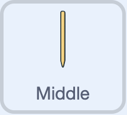

## Out!

\--- task ---

Select the **Middle** stump sprite.



\--- /task ---

This sprite will tell the player that the current batter is out and reduce the number of wickets by 1.

If the batters have all lost their wickets, this sprite will give the player their score.

\--- task ---

Add a `when I receive wicket!`{:class="block3events"} block.

```blocks3
when I receive [wicket! v]
```

\--- /task ---

\--- task ---

Reduce `Wickets`{:class="block3variables"} by 1.

```blocks3
when I receive [wicket! v]
+change [Wickets v] by (-1)
```

\--- /task ---

\--- task ---

Check if no wickets remain.

```blocks3
when I receive [wicket! v]
change [Wickets v] by (-1)
+if <(Wickets) = (0) > then
else
```

\--- /task ---

\--- task ---

If no wickets remain, tell the player that their 'team' is out.

```blocks3
when I receive [wicket! v]
change [Wickets v] by (-1)
if <(Wickets) = (0) > then
+say [ALL OUT!] for (1) seconds
else
```

\--- /task ---

\--- task ---

Use a `join`{:class="block3operators"} block to tell the player the score.

```blocks3
when I receive [wicket! v]
change [Wickets v] by (-1)
if <(Wickets) = (0) > then
say [ALL OUT!] for (1) seconds
+say (join [You scored: ] (Score)) for (2) seconds
else
```

\--- /task ---

\--- task ---

Combine **two** `join`{:class="block3operators"} blocks to tell the player the number of deliveries.

```blocks3
when I receive [wicket! v]
change [Wickets v] by (-1)
if <(Wickets) = (0) > then
say [ALL OUT!] for (1) seconds
say (join [You scored: ] (Score)) for (2) seconds
+say (join [From ] (join (Deliveries) [ deliveries!])) for (2) seconds
else
```

\--- /task ---

\--- task ---

If the player has wickets left, tell them that the current batter is out.

```blocks3
when I receive [wicket! v]
change [Wickets v] by (-1)
if <(Wickets) = (0) > then
say [ALL OUT!] for (1) seconds
say (join [You scored: ] (Score)) for (2) seconds
say (join [From ] (join (Deliveries) [ deliveries!])) for (2) seconds
else
+say [OUT!] for (0.5) seconds
```

\--- /task ---

\--- task ---

**Test:** Press <kbd>n</kbd>, then use the <kbd>b</kbd> key to get out **three** times. Check that the player is told each batter is "OUT!", and when all three batters have lost their wickets, check that the player is told the team is "ALL OUT!" and is given the score.

\--- /task ---
