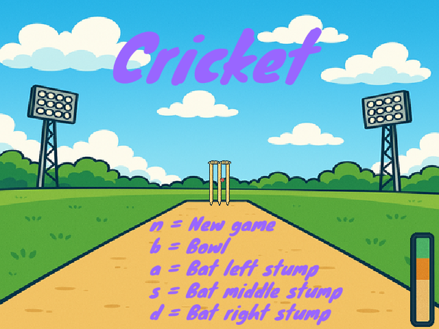

## What you will make

Create a fun cricket game!

--- print-only ---

--- /print-only ---

--- no-print ---

Use the controls to play the game.

**Tip:** Press <kbd>n</kbd> to start a new game.

 <iframe allowtransparency="true" width="485" height="402" src="https://scratch.mit.edu/projects/embed/1202448080/?autostart=false" frameborder="0"></iframe>

--- /no-print ---

