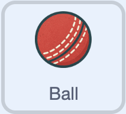

## Bowling

--- task ---

Open the [starter project](https://scratch.mit.edu/projects/1170742109/editor/){:target="_blank"}.

--- /task ---

The starter project contains some starter code and all the sprites you need.

--- task ---

Select the **Ball** sprite. 

--- /task ---

### Take aim!

A ball will be bowled to a random stump.

--- task ---

In the `when I receive`{:class="block3events"} block, set a random stump to bowl at.

```blocks3
when I receive [New Ball v]
set size to (80)%
go to x: (120) y: (80)
+set [Stump v] to (item(pick random (1) to (3)) of [Stumps v])
```

--- /task ---

--- task ---

Tell the player the chosen stump (so they know where to move their bat later).

```blocks3
when I receive [New Ball v]
set size to (80)%
go to x: (120) y: (80)
set [Stump v] to (item(pick random (1) to (3)) of [Stumps v])
+say (Stump) for (0.5) seconds
```

--- /task ---

### Bowl at the stump

--- task ---

The ball points towards the chosen stump and moves towards it, until it reaches it.

```blocks3
when I receive [New Ball v]
set size to (80)%
go to x: (120) y: (80)
set [Stump v] to (item(pick random (1) to (3)) of [Stumps v])
say (Stump) for (0.5) seconds
+repeat until <touching (Stump)?>
point towards (Stump)
move (4) steps
end
```

--- /task ---

### Get some perspective

--- task ---

The ball should look smaller as it moves towards the stump.

```blocks3
when I receive [New Ball v]
set size to (80)%
go to x: (120) y: (80)
set [Stump v] to (item(pick random (1) to (3)) of [Stumps v])
say (Stump) for (0.5) seconds
repeat until <touching (Stump)?>
point towards (Stump)
move (4) steps
+set size to ((size) - (3)) %
end
```

--- /task ---

### Let other sprites know a ball has been bowled

--- task ---

Add a new `broadcast`{:class="block3events"} message.

```blocks3
when I receive [New Ball v]
set size to (80)%
go to x: (120) y: (80)
set [Stump v] to (item(pick random (1) to (3)) of [Stumps v])
say (Stump) for (0.5) seconds
repeat until <touching (Stump)?>
point towards (Stump)
move (4) steps
set size to ((size) - (3)) %
end
+broadcast (ball bowled v)
+wait (1) seconds
```

--- /task ---

### Over!

There are 6 balls in each over.

--- task ---

Check if it is the end of an over.

```blocks3
when I receive [New Ball v]
set size to (80)%
go to x: (120) y: (80)
set [Stump v] to (item(pick random (1) to (3)) of [Stumps v])
say (Stump) for (0.5) seconds
repeat until <touching (Stump)?>
point towards (Stump)
move (4) steps
set size to ((size) - (3)) %
end
broadcast (ball bowled v)
wait (1) seconds
+if <(Balls) = (0)> then
end
```

--- /task ---

--- task ---

If it is, tell the player and reset the number of balls to 6.

```blocks3
when I receive [New Ball v]
set size to (80)%
go to x: (120) y: (80)
set [Stump v] to (item(pick random (1) to (3)) of [Stumps v])
say (Stump) for (0.5) seconds
repeat until <touching (Stump)?>
point towards (Stump)
move (4) steps
set size to ((size) - (3)) %
end
broadcast (ball bowled v)
wait (1) seconds
if <(Balls) = (0)> then
+say [That's over!] for (1) seconds
+set [Balls v ] to (6)
end
```

--- /task ---

--- task ---

**Test:** Press <kbd>n</kbd> then <kbd>b</kbd> - check ‘That’s over!’ is called after six balls and the Balls variable is reset to 6.

--- /task ---