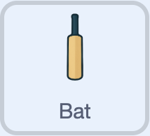

## Move the bat

The player needs to move the bat to the stump the ball is moving towards.

Some code has been added for you already.

### Complete the bat controls

--- task ---

Select the **Bat** sprite. 



--- /task ---

You need to make the bat move to the right stump when the <kbd>d</kbd> key is pressed.

--- task ---

Copy or duplicate the script for the <kbd>a</kbd> or <kbd>s</kbd> key controls and change the values so the shot is set to the `Right` stump when the <kbd>d</kbd> key is pressed.

```blocks3
when [d v] key pressed
show
set [Shot v] to [Right]
```

--- /task ---

### After a ball is bowled

A `ball bowled`{:class="block3events"} event is broadcast when the ball reaches a stump.

--- task ---

Add a `when I receive ball bowled`{:class="block3events"} block to the **Bat** sprite.

```blocks3
when I receive [ball bowled v]
```

--- /task ---

--- task ---

Check if the **Bat** sprite is touching the ball.

```blocks3
when I receive [ball bowled v]
+if <touching (Ball v)?> then
else
```

--- /task ---

--- task ---

If the bat is touching the ball, the player needs to score some runs!

```blocks3
when I receive [ball bowled v]
if <touching (Ball v)?> then
+set [Runs v] to (pick random (1) to (6))
else
```

**Notice:** The number of runs scored is a random number between `1` and `6`.

--- /task ---

--- task ---

Update the `Score`{:class="block3variables"} variable.

```blocks3
when I receive [ball bowled v]
if <touching (Ball v)?> then
set [Runs v] to (pick random (1) to (6))
+change [Score v] by (Runs)
else
```

--- /task ---

--- task ---

**Test:** Press <kbd>n</kbd> then <kbd>b</kbd>, then move the bat. Check that the player can score runs.

--- /task ---

--- task ---

Tell the player how many runs they scored.

**Notice:** There is a space before the word 'runs' to separate the number of runs from the word 'runs'.

```blocks3
when I receive [ball bowled v]
if <touching (Ball v)?> then
set [Runs v] to (pick random (1) to (6))
change [Score v] by (Runs)
+if <(Runs) = (1)> then
say [1 run!] for (0.5) seconds
else
say (join (Runs) [ runs!]) for (0.5) seconds
end
else
```

**Notice:** The code checks if the player scored just one run, because it would not sound right to say “1 runs!” instead of “1 run!”. It uses the word 'runs' if the score is between two and six runs.

--- /task ---

--- task ---

If the bat is not touching the ball when it arrives at a stump, the player needs to lose a wicket.

You will add code to the **Middle** stump sprite to handle this.

Add a new `broadcast`{:class="block3events"} message to inform the **Middle** stump sprite.

```blocks3
when I receive [ball bowled v]
if <touching (Ball v)?> then
set [Runs v] to (pick random (1) to (6))
if <(Runs) = (1)> then
say [1 run!] for (0.5) seconds
else
say (join (Runs) [ runs!]) for (0.5) seconds
end
change [Score v] by (Runs)
else
+broadcast (wicket! v)
```

--- /task ---

--- task ---

**Test:** Press `n` then `b`, then move the bat to score runs. Check that the player is told the number of runs they have scored.

--- /task ---
