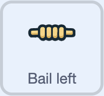
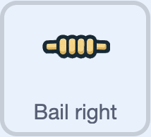

### Knock the bails off

Start with the **Bail left** sprite. 



--- task ---

Add a `when I receive wicket!`{:class="block3events"} block.

```blocks3
when I receive [wicket! v]
```

--- /task ---

To create a spinning bail, your code needs to repeat some motion many times.

--- task ---

Add a `repeat`{:class="block3control"} block.

```blocks3
when I receive [wicket! v]
+repeat (10)
end
```

--- /task ---

--- task ---

Add `Motion`{:class="block3motion"} blocks to turn and move the bail randomly each time the code repeats.

```blocks3
when I receive [wicket! v]
repeat (10)
+turn cw (pick random (300) to (10000)) degrees
+move (pick random (1) to (10)) steps
end
```

--- /task ---

You need to change the size of the bail randomly too.

--- task ---

Add a `change size`{:class="block3looks"} block.

```blocks3
when I receive [wicket! v]
repeat (10)
turn cw (pick random (300) to (10000)) degrees
move (pick random (1) to (10)) steps
+change size by (pick random (-2) to (3))
end
```

--- /task ---

--- task ---

Experiment with different values for the `turn`{:class="block3motion"} and `move`{:class="block3motion"} blocks.

--- /task ---

### Reset the bail

--- task ---

Add a `wait`{:class="block3control"} block, then reset the `size`{:class="block3looks"}, `x: y:`{:class="block3motion"} position, and rotation `direction`{:class="block3motion"} of the bail.

```blocks3
when I receive [wicket! v]
repeat (10)
turn cw (pick random (300) to (10000)) degrees
move (pick random (1) to (10)) steps
change size by (pick random (-2) to (3))
end
+wait (1) seconds
+set size to (6) %
+go to x: (-6) y: (2)
+point in direction (90)
```

--- /task ---

--- task ---

**Test:** Press <kbd>n</kbd> then <kbd>b</kbd>, then get bowled. Check that the left bail flies off.

--- /task ---

### Make both bails fly

--- task ---

Drag the complete code from the **Bail left** sprite to the **Bail right** sprite to copy it.

--- /task ---

--- task ---

Click on the **Bail right** sprite.



Check that the code that you have copied is there.

--- /task ---

--- task ---

Change the reset position of the **Bail right** sprite.

```blocks3
when I receive [wicket! v]
repeat (10)
turn cw (pick random (300) to (10000)) degrees
move (pick random (1) to (10)) steps
change size by (pick random (-2) to (3))
end
wait (1) seconds
set size to (6) %
+go to x: (6) y: (2)
point in direction (90)
```

--- /task ---

--- task ---

**Test:** Press <kbd>n</kbd> then <kbd>b</kbd>, then get out. Check that both bails fly off.

--- /task ---